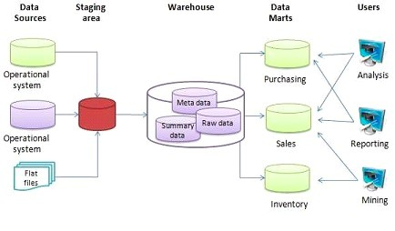

# Data Warehouse and BigQuery

### Table of contents

    - OLAP vs OLTP
    - What is data warehouse
    - BigQuery
      - Cost 
      - Partitions vs Clustering
      - Best practice
      - Internals
      - ML in BQ

## Data Warehouse
### OLAP vs OLTP

- OLTP: Online Transaction Processing
- OLAP: Online Analytical Processing
  
|   | OLTP | OLAP |
|---|---|---|
| Purpose | Control and run essential business operations in real time | Plan, solve problems, support decisions, discover hidden insights |
| Data updates | Short, fast updates initiated by user | Data periodically refreshed with scheduled, long-running batch jobs |
| Database design | Normalized databases for efficiency | Denormalized databases for analysis |
| Space requirements | Generally small if historical data is archived | Generally large due to aggregating large datasets |
| Backup and recovery | Regular backups required to ensure business continuity and meet legal and governance requirements | Lost data can be reloaded from OLTP database as needed in lieu of regular backups |
| Productivity | Increases productivity of end users | Increases productivity of business managers, data analysts and executives |
| Data view | Lists day-to-day business transactions | Multi-dimensional view of enterprise data |
| User examples | Customer-facing personnel, clerks, online shoppers | Knowledge workers such as data analysts, business analysts and executives |

### Data Warehouse:
- OLAP solution 
- Used for **reporting** and **data analysis**
- Data:
  - **historical** and **aggregated**
  - **denormalized**
  - **updated in batches**
  - **optimized for read-only queries** and **complex queries**

## BigQuery

  

