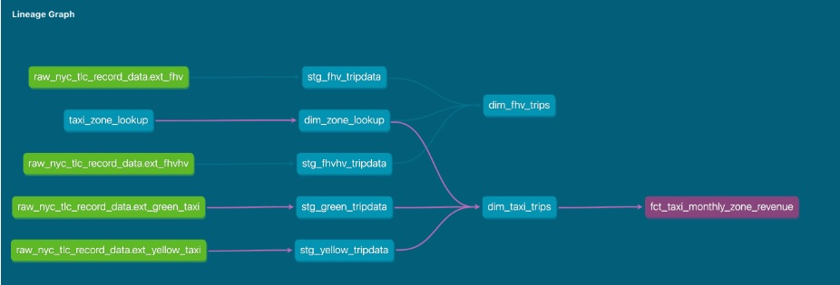
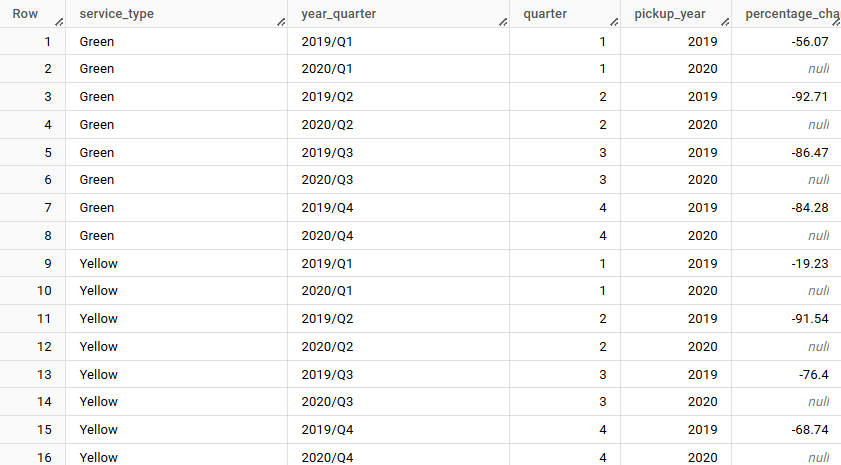
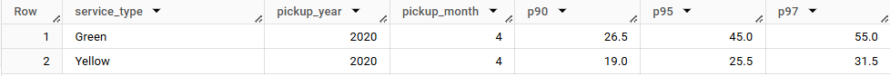
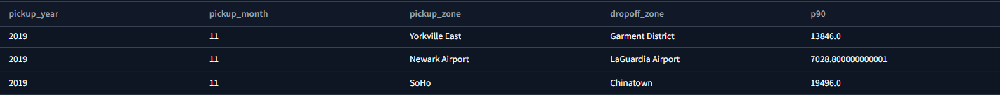

# Module 4

In this homework, we will be working with a dataset of taxi rides in New York City. The dataset contains information about the pickup and dropoff locations, the pickup and dropoff times, and the fare amount, among other things. The goal of this homework is to analyze the dataset and answer some questions about the taxi rides in New York City.

## Data
- Green Taxi Trip Records (2019 and 2020): This dataset contains information about green taxi trips in New York City in 2019 and 2020. The dataset is available on the [NYC Open Data website](https://data.cityofnewyork.us/Transportation/2019-Green-Taxi-Trip-Data/2np7-5jsg). The dataset contains information about the pickup and dropoff locations, the pickup and dropoff times, the fare amount, and other information about the taxi rides. The dataset is available in CSV format. The dataset contains 7,778,101 records.
- Yellow Taxi Trip Records (2019 and 2020): This dataset contains information about yellow taxi trips in New York City in 2019 and 2020. The dataset is available on the [NYC Open Data website](https://data.cityofnewyork.us/Transportation/2019-Yellow-Taxi-Trip-Data/2upf-qytp). The dataset contains information about the pickup and dropoff locations, the pickup and dropoff times, the fare amount, and other information about the taxi rides. The dataset is available in CSV format. The dataset contains 109,047,518 records.
- For-Hire Vehicle Trip Records (2019): This dataset contains information about for-hire vehicle trips in New York City in 2019 and 2020. The dataset is available on the [NYC Open Data website](https://data.cityofnewyork.us/Transportation/2019-For-Hire-Vehicle-FHV-Trip-Data/2v9c-2k7f). The dataset contains information about the pickup and dropoff locations, the pickup and dropoff times, the fare amount, and other information about the taxi rides. The dataset is available in CSV format. The dataset contains 43,244,696 records.

## Loading Data 
First, get your gcs.json for the google cloud storage and place it in the root directory. Then, run load.py[./load.py] (remember for change service type and year) for loading the data into the Google Cloud Storage. Finally, run the following sql command to load the data into the BigQuery.

```sql
-- --------------------FROM CSV----------------------------------
CREATE OR REPLACE EXTERNAL TABLE `terraform-demo-448714.dbt_jgrandgarden.exeternal_green_tripdata`
OPTIONS (
  format = 'CSV',
  uris = ['gs://dezoomcamp_homework3_2025/green_tripdata_*.csv']
);

CREATE OR REPLACE TABLE `terraform-demo-448714.dbt_jgrandgarden.green_tripdata`
AS
SELECT * 
FROM `terraform-demo-448714.dbt_jgrandgarden.exeternal_green_tripdata`;


CREATE OR REPLACE EXTERNAL TABLE `terraform-demo-448714.dbt_jgrandgarden.exeternal_yellow_tripdata`
OPTIONS (
  format = 'CSV',
  uris = ['gs://dezoomcamp_homework3_2025/yellow_tripdata_*.csv']
);

CREATE OR REPLACE TABLE `terraform-demo-448714.dbt_jgrandgarden.yellow_tripdata`
AS
SELECT * 
FROM `terraform-demo-448714.dbt_jgrandgarden.exeternal_yellow_tripdata`;

CREATE OR REPLACE EXTERNAL TABLE `terraform-demo-448714.dbt_jgrandgarden.exeternal_fhv_tripdata`
OPTIONS (
  format = 'CSV',
  uris = ['gs://dezoomcamp_homework3_2025/fhv_tripdata_*.csv']
);

CREATE OR REPLACE TABLE `terraform-demo-448714.dbt_jgrandgarden.fhv_tripdata`
AS
SELECT * 
FROM `terraform-demo-448714.dbt_jgrandgarden.exeternal_fhv_tripdata`;
```

Above code will load the green, yellow and fhv trip data into the BigQuery by create external table and then create a new table from the external table.

## Build the staging models for the green, yellow and fhv trip data and then build dimensions and facts for taxi_trips with `dim_zones`.

After loading `taxi_rides_ny` into `dbt cloud`. Run the following command to build the staging models for the green, yellow and fhv trip data.
    
```bash
dbt build --select staging.green_tripdata
dbt build --select staging.yellow_tripdata
dbt build --select staging.fhv_tripdata
```

Then, run the following command to build the dimensions and facts for taxi_trips with `dim_zones`.

```bash
dbt build --select dim_zones
dbt build --select taxi_trips
```

## Questions

### Question 1: Understanding dbt model resolution

Provide you've got the following sources.yaml 
```yaml
version: 2

sources:
  - name: raw_nyc_tripdata
    database: "{{ env_var('DBT_BIGQUERY_PROJECT', 'dtc_zoomcamp_2025') }}"
    schema:   "{{ env_var('DBT_BIGQUERY_SOURCE_DATASET', 'raw_nyc_tripdata') }}"
    tables:
      - name: ext_green_taxi
      - name: ext_yellow_taxi
```
with the following env variables setup where dbt runs:
```bash
export DBT_BIGQUERY_PROJECT=myproject
export DBT_BIGQUERY_DATASET=my_nyc_tripdata
```
What does this .sql model compile to?
    
```sql select * 
from {{ source('raw_nyc_tripdata','ext_green_taxi' ) }}
```

For solving this problem, you should setup the `sources.yaml` and [`env variables`](https://docs.getdbt.com/docs/build/environment-variables) as described above. Then, run the following command to compile the model.

```sql
select * from myproject.my_nyc_tripdata.ext_green_taxi
```

### Question 2: dbt Variables & Dynamic Models
Say you have to modify the following dbt_model (`fct_recent_taxi_trips.sql`) to enable Analytics Engineers to dynamically control the date range.

- In development, you want to process only the last 7 days of trips
- In production, you need to process the last 30 days for analytics

For command line arguments, you can use the `--vars` flag to pass variables to dbt. For example, to pass the `env` variable to dbt, you can run the following command.

```sql
select *
from {{ ref('fact_taxi_trips') }}
where pickup_datetime >= CURRENT_DATE - INTERVAL '{{ var("days_back", env_var("DAYS_BACK", 30)) }}' DAY
```

### Question 3: dbt Data Lineage and Execution
Considering the data lineage below and that taxi_zone_lookup is the only materialization build (from a .csv seed file):



Select the option that does `NOT` apply for materializing fct_taxi_monthly_zone_revenue:

✅ `dbt run` : Builds all models in the project.

✅ `dbt run --select +models/core/dim_taxi_trips.sql+ --target prod` Selects `dim_taxi_trips.sql` and its up/downstream dependencies.

✅ `dbt run --select +models/core/fct_taxi_monthly_zone_revenue.sql` Selects `fct_taxi_monthly_zone_revenue` and its upstream dependencies.

✅ `dbt run --select +models/core/` : Selects all models in the `core` directory and its upstream dependencies.

❌ `dbt run --select models/staging/+` : Selects all models in the `staging` directory and its downstream dependencies. Because the `fct_taxi_monthly_zone_revenue` is dependent on the `dim_zones` which are in the `core` directory. Therefore, it will be error if you run this command.

### Question 4: dbt Macros and Jinja

## Serious SQL Question
Firstly, update `fact_taxi_trips.sql` to add some new dimensions `year`, `year_quater`, `quarter`, `month` **extracted from pickup_datetime**, to your fct_taxi_trips OR dim_taxi_trips.sql models to facilitate filtering your queries by following this [sql](./macros/get_year_quarter.sql) (REMEMBER: adding macro get_year_quarter.sql to extract year_quater easier).


### Question 5: Taxi Quarterly Revenue Growth
1. Create a new model [`fct_taxi_trips_quarterly_revenue.sql`](./models/core/fct_taxi_trips_quarterly_revenue.sql) by compute the Quarterly Revenues for each year for based on `total_amount`
2. Analyze and compute the Quarterly YoY (Year-over-Year) revenue growth with [`fct_taxi_trips_YoY_quarterly_revenue.sql`](./models/analyses/fct_taxi_trips_YoY_quarterly_revenue.sql) by following formula:
    $$YoY = (Q_{2020} - Q_{2019}) / Q_{2019}$$

Result:



### Question 6: P97/P95/P90 Taxi Monthly Fare
1. Create a new model [`fct_taxi_trips_monthly_fare.sql`](./models/analyses/fct_taxi_trips_monthly_fare.sql)
2. Filter out invalid entries (`fare_amount` > 0, `trip_distance` > 0, and `payment_type_description in ('Cash', 'Credit Card')`) (Tips: use `lower()` function to convert the payment_type_description to lowercase)
3. Compute the continous percentile of `fare_amount` partitioning by service_type, year and and month using PERCENTILE_CONT function with 0.5, 0.75, 0.9, 0.95, 0.99
4. Analyze the fare amount distribution for Green Taxi and Yellow Taxi in April 2020

Result:



### Question 7: Top #Nth longest P90 travel time Location for FHV

Prerequisites:

- Create a staging model for FHV Data (2019), and **DO NOT** add a deduplication step, just filter out the entries where where dispatching_base_num is not null in [here](./models/staging/stg_fhv_tripdata.sql)
- Create a core model for FHV Data (dim_fhv_trips.sql) joining with `dim_zones` what has been done [here](./models/core/dim_fhv_trips.sql)
- Add some new dimensions year (e.g.: 2019) and month (e.g.: 1, 2, ..., 12), based on pickup_datetime, to the core model to facilitate filtering for your queries as [Question 5](###-Question-5:-Taxi-Quarterly-Revenue-Growth)

Now...

1. Create a new model [`fct_fhv_monthly_zone_traveltime_p90.sql`](./analyses/fct_fhv_monthly_zone_traveltime_p90.sql)
2. For each record in `dim_fhv_trips.sql`, compute the [timestamp_diff](https://cloud.google.com/bigquery/docs/reference/standard-sql/timestamp_functions#timestamp_diff) in seconds between dropoff_datetime and pickup_datetime - we'll call it `trip_duration` for this exercise
   - Create a Common Table Expression (CTE) `fct_fhv_monthly_zone_traveltime` to calculate the trip duration in seconds for each trip.

        ```sql
        with fct_fhv_monthly_zone_traveltime as (
        select *, TIMESTAMP_DIFF(dropoff_datetime, pickup_datetime, SECOND) as trip_duration
        from {{ref('dim_fhv_trips')}})
        ```
3. Compute the continous p90 of trip_duration partitioning by year, month, pickup_location_id, and dropoff_location_id
   - Create another CTE `fct_fhv_monthly_zone_traveltime_p90` to calculate the 90th percentile (P90) of trip durations, partitioned by year, month, pickup location, and dropoff location. Also, assign a row number to each record within the partition.
  
    ```sql
        , fct_fhv_monthly_zone_traveltime_p90 as (
        select pickup_year, pickup_month, pickup_zone, dropoff_zone,
            PERCENTILE_CONT(trip_duration, 0.9) OVER (PARTITION BY pickup_year, pickup_month, pickup_locationid, dropoff_locationid) as p90,
            row_number() over(partition by pickup_year, pickup_month, pickup_locationid, dropoff_locationid) as rn
        from fct_fhv_monthly_zone_traveltime
        where pickup_year = 2019 and pickup_month = 11 and lower(pickup_zone) in ('newark airport', 'soho', 'yorkville east')
    )
    ```
4. Filter the records where rn = 1 to get the 2nd longest travel time for each pickup and dropoff location in November 2019
   ```sql
    SELECT pickup_year, pickup_month, pickup_zone, dropoff_zone, p90
    FROM fct_fhv_monthly_zone_traveltime_p90
    where p90 in (
        select max(p90) 
        from fct_fhv_monthly_zone_traveltime_p90 
        where p90 not in (
            select max(p90) 
            from fct_fhv_monthly_zone_traveltime_p90 
            group by pickup_zone
        ) 
        group by pickup_zone
    )
    and rn = 1
   ```

Result:

